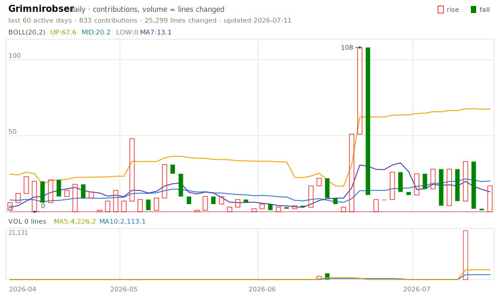

**Hi there, I'm Eron.**

 
 

### My contributions, traded daily 📈

<picture>
  <source media="(prefers-color-scheme: dark)" srcset="kline/kline-dark.svg">
  
</picture>

Candlesticks: close = today's contributions, open = yesterday's — red rallies, green sell-offs.
Rendered daily by <a href="https://github.com/Grimnirobser/github-kline">github-kline</a>.
